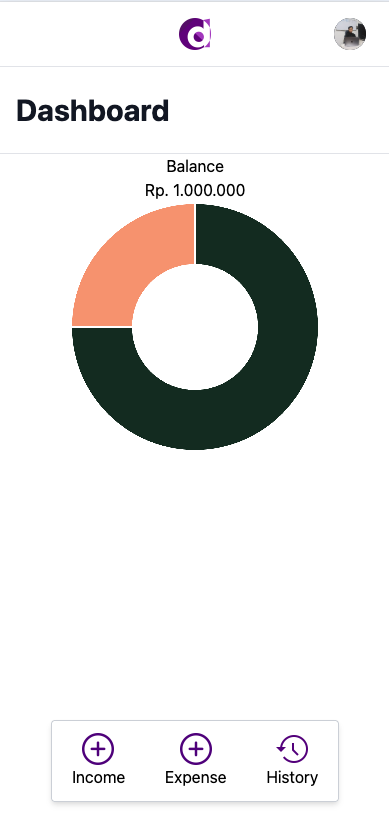

<p align="center">
  <a href="#">
    
  </a>
</p>

<h1 align="center">D‑Budget – Manajemen Anggaran Pribadi</h1>

<p align="center">
  Aplikasi web untuk mencatat pemasukan, pengeluaran, kategori, dan melihat ringkasan di dashboard.
  <br/>
  <a href="#penggunaan"><strong>Lihat cara penggunaan »</strong></a>
  <br/>
  <br/>
  <a href="#instalasi">Instalasi</a>
  ·
  <a href="#kontribusi">Kontribusi</a>
  ·
  <a href="#lisensi">Lisensi</a>
  
</p>

---

## Daftar Isi
- [Deskripsi](#deskripsi)
- [Fitur](#fitur)
- [Tech Stack](#tech-stack)
- [Instalasi](#instalasi)
  - [Prasyarat](#1-prasyarat)
  - [Clone & Dependensi](#2-clone--dependensi)
  - [Konfigurasi Aplikasi](#3-konfigurasi-aplikasi)
  - [Variabel Lingkungan](#4-variabel-lingkungan-opsional)
  - [Jalankan Lokal](#5-jalankan-lokal)
- [Penggunaan](#penggunaan)
- [Tangkapan Layar](#tangkapan-layar)
- [Struktur Proyek](#struktur-proyek)
- [Kontribusi](#kontribusi)
- [Lisensi](#lisensi)
- [Ucapan Terima Kasih](#ucapan-terima-kasih)

## Deskripsi
<p align="center">
  
  <br/>
</p>

D‑Budget adalah frontend React untuk aplikasi pengelolaan anggaran. Pengguna dapat masuk, menambahkan pemasukan/pengeluaran beserta kategori, melihat riwayat, serta memantau ringkasan saldo dan arus kas.

## Fitur
- Manajemen pemasukan dan pengeluaran (CRUD)
- Manajemen kategori transaksi
- Ringkasan saldo dan arus kas pada dashboard (Chart.js)
- Riwayat transaksi
- Autentikasi pengguna (Login/Logout) dengan dukungan Google OAuth
- Routing SPA dengan React Router

## Tech Stack
<p>
  <a href="https://react.dev/"></a>
  <a href="https://redux.js.org/"></a>
  <a href="https://reactrouter.com/"></a>
  <a href="https://tailwindcss.com/"></a>
  <a href="https://styled-components.com/"></a>
  <a href="https://www.chartjs.org/"></a>
  <a href="https://headlessui.dev/"></a>
</p>

## Instalasi

### 1) Prasyarat
- Node.js 14+ (disarankan 16/18)
- npm 6+ atau yarn 1.x
- Backend D‑Budget berjalan di `http://localhost:5001` (lihat folder `d-budget-backend`)

### 2) Clone & Dependensi
```bash
# Clone repo
git clone https://github.com/<kamu>/d-budget.git
cd d-budget/d-budget-frontend

# Install dependensi
npm install
# atau
yarn install
```

### 3) Konfigurasi Aplikasi
Frontend saat ini menggunakan base URL API hardcode `http://localhost:5001` pada beberapa file:

```text
src/actions/index.js
src/containers/Dashboard/index.js
src/containers/Expense/index.js
src/containers/Income/income.js
src/containers/Category/index.js
src/components/HistoryRow/index.js
src/containers/Logout/index.js
```

Jika backend berjalan pada host/port lain, perbarui konstanta `API` pada file-file tersebut, atau lakukan refactor untuk membaca dari variabel lingkungan.

### 4) Variabel Lingkungan (opsional)
Belum ada `REACT_APP_*` yang digunakan. Jika ingin menambahkan, buat file `.env` di direktori `d-budget-frontend/` dan gunakan pola:

```env
REACT_APP_API_URL=http://localhost:5001
```

Lalu ganti semua konstanta `API` agar membaca `process.env.REACT_APP_API_URL`.

### 5) Jalankan Lokal
```bash
# Mode pengembangan
npm start
# atau
yarn start

# Aplikasi akan berjalan di http://localhost:3000
```

## Penggunaan
- Masuk melalui halaman Login (dukungan Google OAuth tersedia).
- Tambahkan pemasukan/pengeluaran dengan memilih kategori.
- Lihat ringkasan saldo dan arus kas di halaman Dashboard.
- Kelola kategori pada menu Category.
- Cek riwayat transaksi pada halaman History.

## Tangkapan Layar
- Tambahkan gambar UI ke folder `src/images/` dan tautkan di bagian ini.

## Struktur Proyek
```
.
├─ craco.config.js
├─ public/
├─ src/
│  ├─ actions/               # Aksi Redux (fetch API, dsb.)
│  ├─ components/            # Komponen presentational (Header, Form, dsb.)
│  ├─ containers/            # Halaman/route (Dashboard, Income, Expense, ...)
│  ├─ reducers/              # Reducer Redux
│  ├─ images/                # Aset gambar (logo: d-logo.png)
│  ├─ style/                 # CSS (Tailwind + custom)
│  └─ index.js               # Entry React
└─ package.json              # Scripts (craco), dependensi
```

## Kontribusi
1. Fork repository dan buat branch fitur/bugfix.
2. Lakukan perubahan dengan commit message yang jelas.
3. Pastikan tidak ada secret yang ter‑commit (gunakan `.env`).
4. Buka Pull Request dengan deskripsi singkat dan screenshot bila perlu.

## Lisensi
MIT License.

## Ucapan Terima Kasih
- Terinspirasi oleh struktur README dari template komunitas dan proyek open‑source.
